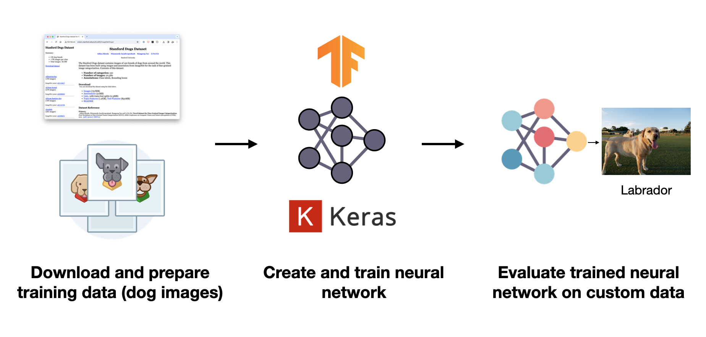
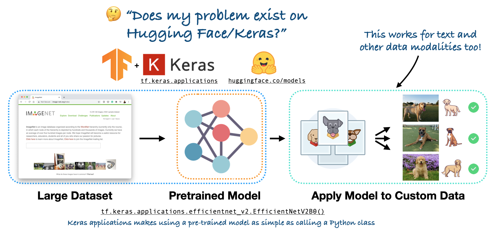
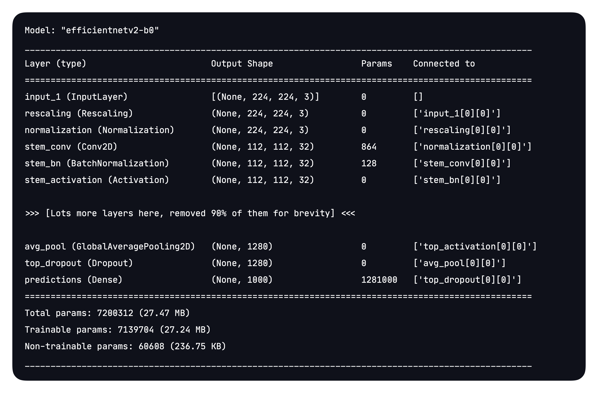
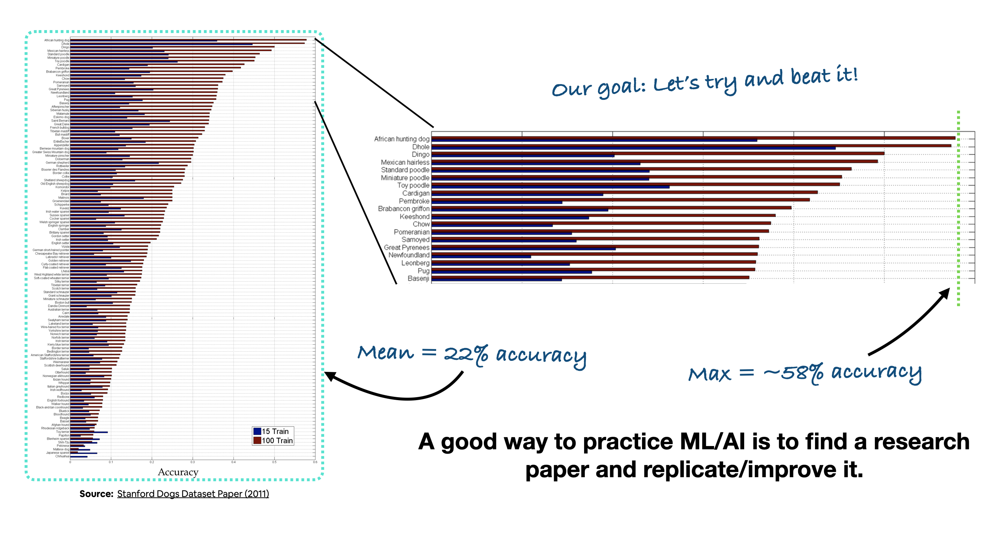

# Dog Vision Classification

An end-to-end computer vision project that classifies dog breeds from images using TensorFlow and Keras. This repo is written as a learning project for enthusiasts who want to understand how a modern image-classification workflow is built: from downloading the data, to preparing labels, to training a pretrained neural network, to evaluating predictions on custom photos.

)

## What this project is about

The goal of Dog Vision is simple: take a photo of a dog and predict its breed.

What makes the project interesting is the full workflow behind it. Instead of jumping straight to a model, the notebook walks through the complete machine-learning pipeline and shows how the data, the architecture, and the evaluation all fit together. It is a practical example of transfer learning for image classification, built in TensorFlow/Keras.

## Why this repo is useful

This project is designed to be educational, but it still follows a realistic workflow:

- It starts with a public dataset and a clear problem statement.
- It prepares the data in a format that TensorFlow can consume efficiently.
- It uses pretrained convolutional neural networks instead of training from scratch.
- It compares experiments and keeps the best trained model for reuse.
- It finishes by running predictions on custom dog photos so the project feels tangible.

## Dataset

The main dataset is the Stanford Dogs dataset, also known as ImageNet Dogs.

- 120 dog breeds
- 20,000+ images
- Predefined training and test splits provided through `.mat` files
- Images originally sourced from the Stanford Visual Recognition Group

The notebook uses the dataset to solve a fine-grained classification problem, which is harder than ordinary image classification because many breeds look very similar.

For the final inference demo, the repo also includes custom photos set in `images/dog-photos.zip` and an extracted sample folder under `custom-dog-photos/`.

If you need the raw data download steps, see [data/how_to_get_data.md](https://github.com/mohsinansari0705/dog-vision-classification/blob/main/data/how_to_get_data.md).

## How the project is built

The notebook follows a straightforward but effective build process:

1. Define the problem as breed classification for dog photos.
2. Load and inspect the Stanford Dogs metadata and file splits.
3. Convert the image folders and labels into TensorFlow-friendly datasets.
4. Normalize and batch the images for training and evaluation.
5. Start from pretrained CNN weights instead of training a model from zero.
6. Train and compare models, then evaluate the strongest candidate.
7. Save the best model and run predictions on custom photos.

This approach is a good example of how to build a project well: keep the data pipeline explicit, make the experiments reproducible, and validate the result on images the model has never seen before.

## Notebook contents

The main notebook is [end-to-end-dog-vision.ipynb](https://github.com/mohsinansari0705/dog-vision-classification/blob/main/end-to-end-dog-vision.ipynb). It covers:

- Getting setup
- Downloading and preparing the dataset
- Exploratory data analysis (EDA)
- Creating training and test splits
- Building TensorFlow datasets
- Training a neural network with transfer learning
- Evaluating the model
- Saving and loading the best model
- Predicting on custom dog photos

## Project structure

- [end-to-end-dog-vision.ipynb](https://github.com/mohsinansari0705/dog-vision-classification/blob/main/end-to-end-dog-vision.ipynb) - the main notebook
- [data/how_to_get_data.md](data/how_to_get_data.md) - data download and extraction instructions
- [images/](images) - diagrams, workflow illustrations, and result screenshots
- [trained_models/](trained_models) - saved Keras model artifacts
- [custom-dog-photos/](custom-dog-photos) - example inference images

## Getting started

If you want to reproduce the notebook locally:

1. Install Python, Jupyter, TensorFlow, NumPy, Pandas, Matplotlib, and Scikit-learn.
2. Download the Stanford Dogs archives using the instructions in [data/how_to_get_data.md](data/how_to_get_data.md).
3. Extract the archives so the notebook can access the `Images/`, `Annotation/`, and `.mat` files.
4. Open [end-to-end-dog-vision.ipynb](end-to-end-dog-vision.ipynb) and run the cells in order.
5. Use the custom dog photos to test the final model on new images.

If you are using Google Colab, the notebook is already written with that workflow in mind.

## Results and outputs

The repo includes saved model files and visual outputs so you can inspect the project without retraining everything from scratch. One of the key goals in the notebook is to improve on the original Stanford Dogs benchmark while keeping the pipeline understandable and reusable.

## Acknowledgements

- Stanford Dogs / ImageNet Dogs dataset
- TensorFlow and Keras
- The original transfer-learning workflow that inspired the notebook structure
